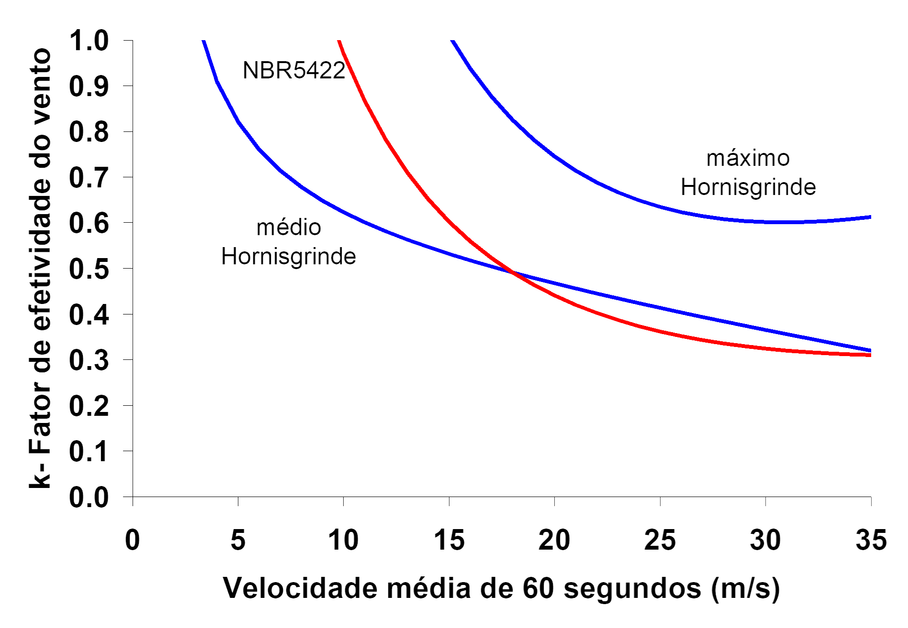
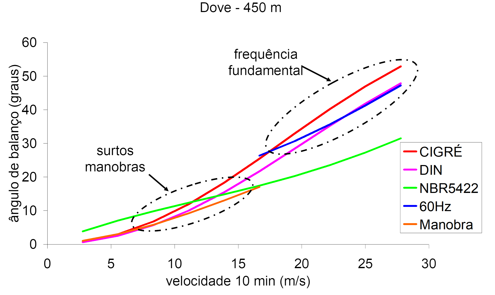

# NBR 5422:2024 - Guia de Aplicação

## Introdução

A norma NBR 5422 apresenta uma série de critérios para assegurar a qualidade de um projeto, porém não é um texto didático.

Este texto, inspirado em publicações semelhantes ([Fuchs, 1982](#Fuchs1982), [Labegalini, 1992](#Labegalini1992)), procura esclarecer a aplicação da norma.

### Convenções

Algumas convenções do GitHub são utilizadas:

> [!TIP]
> O texto nestas caixas são dicas práticas sobre a seção

> [!IMPORTANT]
> O texto nestes caixas são informações importantes para a aplicação da seção

## Histórico

O desenvolvimento da versão atual da NBR 5422 foi abordado ao longo dos anos em diversos artigos de congresso:

1. A. A. Menezes Jr., J. I. Silva Filho e C. E. O. Coutinho, "Velocidades máximas de vento no Brasil – Analise estatística e mapeamento de isótacas," VII SNPTEE, GLT-05, Brasília, 1984.​
2. O. Régis Jr, "Novos critérios estatísticos para cálculo de ampacidade de LT's," IX SNPTEE, Belo Horizonte, 1987.​
3. FT GCPS/ GCOI, "Ampacidade estatística de linhas aéreas de transmissão com cabos alumínio/aço," XII SNPTEE, GLT-19, Recife, 1993.​
4. C. Kosmann, "Avaliação de ampacidade estatística da LT 138 kV Joinville/ Eletrosul – Joinville IV," XIV SNPTEE, Belém, 1997.​
5. J. I. Silva Filho, V. H. G. Andrade, J. B. S. Borges e C. E. O. Coutinho, "Considerações sobre o vento no projeto e recapacitação de linhas de transmissão," XVI SNPTEE, Campinas, 2001.​
6. A. P. Ruffier, J. I. Silva Filho, L. F. Estrella Jr. e E. F. A. Lisboa, "Uma avaliação da influência do método de cálculo da carga de vento para o dimensionamento de estruturas de linhas de transmissão," XVII SNPTEE, GLT-16, 2003.​
7. A. A. Menezes Jr., A. L. Tan e D. Fernandes, "Velocidade de vento de elevada intensidade ocorridas em Florianópolis e Passo Fundo – Um enfoque estatístico e meteorológico para projetos de LTs," XVII SNPTEE, GLT-14, 2003.​
8. C. P. R. Gabaglia, C. M. F. de Oliveira, J. I. Silva Filho, F. S. Moreira e A. P. Ruffier. "Ampacidade estatística - medições em laboratório e de campo," XVIII SNPTEE, GLT-06, Curitiba, 2005.​
9. A. O. Silva et al, "Coeficientes de arrasto aerodinâmico em estruturas treliçadas de linhas de transmissão," XVIII SNPTEE, GLT-17, Curitiba, 2005.​
10. J. I. Silva Filho, A. A. Menezes Jr., A. P. Ruffier, L. F. Estrella Jr. e J. L. G. Dias, “Esforços devidos ao vento sobre componentes de LTs e fatores de correção normativos compatíveis com a realidade brasileira,” XVIII SNPTEE, GLT-19, Curitiba, 2005.​
11. A. Consentino, C. Kosmann, S. Colle e R. N. Fontoura Filho, "Carregamentos de LTs na região serrana de Santa Catarina - Comparação de resultados obtidos com a NBR 5422 atual e proposta," XII ERIAC, Foz do Iguaçu, 2007.​
12. J. I. Silva Filho  e A. A. Menezes Jr., "Determinação da velocidade de vento de projeto por meio de métodos alternativos aos vigentes e uso de técnicas mais adequadas a redes anemométricas com coletas escassas," XXIX SNPTEE, GLT-12, Rio de Janeiro, 2007.​
13. A. Consentino, C. Kosmann, S. Colle e R. Hass, "Analise estatística da ampacidade sazonal da LT 525 kV Areia – Campos Novos, utilizando-se técnicas de downscaling de dados meteorológicos, com apoio em mapeamento a laser," XIX SNPTEE, GLT-24, Rio de Janeiro, 2007.​
14. C. Kosmann, A. Consentino e J. N. Hoffmann, "Analise de projetos de linhas de transmissão sob a ótica da ampacidade estatística proposta na revisão da norma NBR 5422," XIII ERIAC, Argentina, 2009.​
15. A. Consentino et al, "Analise estatística das capacidades operativas sazonais de linhas de transmissão utilizando curvas de carga," XIV ERIAC, Paraguai, 2011.​
16. R. D. Machado et al, "A utilização da climatologia virtual na análise de carregamentos em linhas de transmissão: um estudo de caso comparando dados simulados contra medidos," XXII SNPTEE, GLT-06, Brasília, 2013.​
17. A. O. Silva, "Uma análise do critério H/w," XXIII SNPTEE, GLT-18, Foz do Iguaçu, 2015.​
18. A. Mpalantinos Neto et al, "A nova norma NBR 5422 – Projetos de linhas aéreas de transmissão de energia elétrica – principais avanços e mudanças," XXVI SNPTEE, GLT-27, Rio de Janeiro, 2022.

> [!IMPORTANT]
> A norma aplica-se a linhas aéreas CA a partir de 38 kV e CC. Alguns aspectos apresentados neste guia serão sobre linhas do Sistema Interligado Brasileiro (SIN), regidas sob o sistema de concessões do Goverrno Federal, logo com regras específicas tais como os leilões de transmissão e os procedimentos de rede do ONS. O guia na medida do possível terá uma aplicação ampla, podendo abordar as particularidades de projeto de linhas para o SIN.

## Dados básicos

Um projeto de linha pressupõe uma proposta inicial, com tensão, correntes e geometria de suportes e cabos, além de um traçado, no qual se implica nos dados de terreno e climatológicos. 

A finalidade neste ponto é chegar a um projeto básico - um perfil de torre típica. O projeto executivo 

Cabe observar que a NBR 5422 não se aplica somente a linhas de transmissão do Sistema Interligado Nacional (SIN) - assim como na sua versão anterior, a norma vale para qualquer linha aérea com tensão nominal acima de 38 kV.

## Referências complementares

Para a devida aplicação da NBR 5422 no projeto de uma linha, outras referências devem ser aplicadas:

* Uma base de dados meteorológicos, como INMET (https://portal.inmet.gov.br/dadoshistoricos)
* Um modelo de cálculo de flecha, como por exemplo do Cigre (Cigre WG 22.12, "The thermal behaviour of overhead conductors", Electra 144, 1992), conforme adotado pela REN ANEEL 905 de 2020, Anexo II (revoga REN 191 2005).

## Fluxo de trabalho

A concretização de um projeto de linha aérea passa por algumas etapas. Especificamente na transmissão do Sistema Interligado Nacional (SIN), algumas etapas são realizadas pela EPE através de seus relatórios técnicos.

1. Planejamento da transmissão (Relatório R1 EPE)
2. Estudos elétricos (Relatório R2 EPE)
3. Definição preliminar da rota e impacto socioambiental (Relatório R3 EPE)
4. Custos fundiários (Relatório R5 EPE) e compartilhamento de instalações (Relatório R4 EPE)
5. Licenciamento
6. Definição final da rota
7. Construção
8. Energização

## Metodologia

### Segurança do projeto

Definições de risco de falha de um projeto

### Elementos solicitantes

Histórico - Labegalini (p. 97)

Ver artigos recentes

### Elementos meteorológicos (seção 4 e Anexo A)

#### Desenvolvimento

Histórico da versão 1985 - mapas

#### Aplicação

Tratamento de dados

Vento de projeto

### Temperatura do condutor (seções 5, 6 e 21, Anexo B)

#### Desenvolvimento

Ampacidade estatística

#### Aplicação

Cálculo das temperaturas no condutor para cada risco térmico, associada a uma distribuição estatística.

Regime de corrente são divididos em nominal e sobrecorrente: um situação temporária, não habitual e não repetitiva, decorrente a uma contingência. Recomenda-se que este regime não ultrapasse 4 dias initerruptos, ou no total 5% do tempo de operação da linha.

A parte do regime de corrente, define-se o risco térmico, no qual a corrente do condutor é excedida devido a corrente e fatores externos, e o risco de falha de uma descarga em qualquer um dos espeçamentos presentes na linha.

As figuras do Anexo B foram geradas a partir de um exemplo processado pelo Claudionor. A ideia é ter no futuro uma rotina interna calculando a temperatura, para uma dada locação (vinculada a uma base de dados INMET).

A partir do risco térmico, extrai-se as temperaturas para 15%, 5% e 1%, para serem associadas as distâncias de segurança.

As correntes podem ser estabelecidas para cada período climático - mas isso já seria implícito no cálculo geral? No final haverá uma temperatura/ distância determinante do projeto.

### Projeto de isolamento (seção 9 e Anexo C)

#### Desenvolvimento

Histórico da formulação

#### Aplicação

A seção 9 provê as parcelas elétricas, a serem aplicadas nas distâncias de segurança (seçao 7) - motivo no qual se deve consultar a seção 9.

|Regime | Condição | Risco térmico | Risco de falha | Símbolo | Fórmula | $K_{cs}$ típico |
|--|--|--|--|--|--|--|
|Nominal | Típica | 15% | $10^{-6}$ | $D_{Vtip,n}$ | $P_{bV} + 0,90 + P_{etip,n}$ | 1,35 |
|  | Limite | 1% | $10^{-4}$ | $D_{Vlim,n}$ | $P_{bV} + 0,60 + P_{elim}$ | 1,25 |
|Sobrecorrente | Típica | 5% | $10^{-4}$ | $D_{Vtip,s}$ | $P_{bV} + 0,60 + P_{etip,s}$ | 1.35 |
|  | Limite | 1% | $10^{-4}$ | $D_{Vlim,s}$ | $P_{bV} + P_{elim}$ | 1,25 |

Distâncias minímas fase-terra e entre fases.

### Distâncias verticais de segurança (seção 7)

#### Desenvolvimento

Histórico, comparação com a versão 1985

#### Aplicação

* Distâncias verticais
* Definição da altura básica do suporte

### Ação mecânica do vento (seção 8)

#### Desenvolvimento

Semelhanças com IEC 60826 e particularidades na NBR

Relação com a NBR 8850

Modelos de ângulo de balanço foram comparados com o modelo da NBR 5422:1985.

1. MORS, H. Wind Pressure on Overhead Transmission Line Conductors – Hornisgrinde Testing Station. CIGRE Report 220, 1956.
2. CIGRE WG 22.06. Probabilistic Design of Overhead Transmission Lines, Technical Brochure 178, February 2001.

Por falta de consenso, manteve-se o modelo de 1985, ficando evidente a necessidade de desenvolvimentos conclusivos para uma amostragem representativa de cabos e vãos.

#### Aplicação

Esforços nos elementos.

Ventos de alta intensidade

Cálculo dos ângulos de balanço.

Balanço assíncrono

#### Pesquisa posterior

Artigos de referência para pesquisa em ventos de alta intensidade:

1. Aboshosha, H., El Damatty, A. Effective technique to analyze transmission line conductors under high intensity winds. Wind and Structures, 18(3), 235-252, 2014.
2. El Damatty, A., Elawady, A. Development of Code Provisions for Transmission Lines under Downbursts Using Numerical Modeling and WindEEE Testing. Advances in Civil, Environmental and Materials Research (ACEM16), Jeju Island, Korea, 2016.
3. Elawady, A. Development of design loads for transmission line structures subjected to downbursts using aero-elastic testing and numerical modeling. Ph.D. Thesis, The University of Western Ontario, Canada, 2016.
4. Aboshosha, H. Response of transmission line conductors under downburst wind. Ph.D. Thesis, The University of Western Ontario, Canada, 2014.
5. Aboshosha, H., Bitsuamlak, G., El Damatty, A. Turbulence characterization of downbursts using LES. Journal of Wind Engineering and Industrial Aerodynamics, 136, 44-61, 2015.

### Distãncias horizontais de segurança (seção 7)

Considerações quanto ao balanço.

Distância entre linhas em um corredor copartilhado.

Consideração entre linhas paralelas com tensões distintas (entre condutores em suportes diferentes).

A NBR 5422:1985 determina como condição uma das linhas em balanço e a outra em repouso, e a diferença fasorial entre os condutores ou a tensão fase-terra do circuito de maior tensão, o que obtiver a maior distância.

Na NBR 5422:2024...

### Projeto mecânico de cabos, suportes e fundações (seções 11, 12 e 13)

Critérios e hipóteses de carregamento.

#### Hipóteses mínimas para cabos

|Hipótese|Condição|Vento|Temperatura ar|Carga ruptura|
|--|--|--|--|--|
|Temperatura minima|Inicial|Sem vento|Mínima|40%|
|Temperatura média das mínimas diárias do mês mais frio|Inicial|Sem vento|Média|Critério $H/p$|
|Vento de projeto de 10 min|Inicial|Sem vento|Média das mínimas diárias|70%|
|Vento de proneto de 3 s|Inicial|Sem vento|Média das mínimas diárias|70%|
|Temperatura típica do condutor|Final|Sem vento|$t_{tip}$|
|Temperatura limite do condutor|FInal|Sem vento|$t_{lim}$|
|Balanço do condutor|Final|||

Critério $H/p$ (ou originalmente $H/w$)

#### Hipóteses mínimas para suportes

<table>
<thead>
  <tr>
    <th rowspan="3" colspan="2">Hipótese</th>
    <th colspan="5">Coeficientes para estado limite de falha</th>
    <th rowspan="3">Descrição</th>
  </tr>
  <tr>
    <th rowspan="2">Permanente</th>
    <th rowspan="2">Vento</th>
    <th colspan="3">Tração nos cabos</th>
  </tr>
  <tr>
    <th>Vertical</th>
    <th>Transversal</th>
    <th>Longitudinal</th>
  </tr>
</thead>
<tbody>
  <tr>
    <td>Vento de projeto de 10 min</td><td>Transversal, componente vertical máxima tração nos cabos</td><td>1,15</td><td>1,0</td><td>1,15</td><td>1,0</td><td>1,0</td><td></td>
  </tr>
  <tr>
    <td></td><td>Transversal, carga vertical reduzida</td><td>1,15</td><td>1,0</td><td>0,87</td><td>1,0</td><td>1,0</td><td></td>
  </tr>
  <tr>
    <td></td><td>Oblíquo, carga vertical máxima</td><td>1,15</td><td>1,0</td><td>1,15</td><td>1,0</td><td>1,0</td><td>Considerar ângulos de incidência de 15°, 30° e 45°.</td>
  </tr>
  <tr>
    <td>Vento de projeto de 3 s</td><td>Transversal</td><td>1,15</td><td>1,0</td><td>1,15</td><td>1,0</td><td>1,0</td><td></td>
  </tr>
  <tr>
    <td></td><td>Oblíquo</td><td>1,15</td><td>1,0</td><td>1,15</td><td>1,0</td><td>1,0</td><td></td>
  </tr>
  <tr>
    <td></td><td>Transversal, pernas inclinadas</td><td>1,15</td><td>1,0</td><td>1,15</td><td>1,0</td><td>1,0</td><td></td>
  </tr>
  <tr>
    <td></td><td>Oblíquo, pernas inclinadas</td><td>1,15</td><td>1,0</td><td>1,15</td><td>1,0</td><td>1,0</td><td></td>
  </tr>
  <tr>
    <td></td><td>Transversal, suportes suspensão</td><td>1,15</td><td>1,0</td><td>1,15</td><td>1,0</td><td>1,0</td><td></td>
  </tr>
  <tr>
    <td></td><td>Longitudinal, suportes suspensão</td><td>1,15</td><td>1,0</td><td>1,15</td><td>1,0</td><td>1,0</td><td></td>
  </tr>
  <tr>
    <td></td><td>Transversal, monomastro suspensão</td><td>1,15</td><td>1,0</td><td>1,15</td><td>1,0</td><td>1,0</td><td></td>
  </tr>
  <tr>
    <td></td><td>Longitudinal, monomastro suspensão</td><td>1,15</td><td>1,0</td><td>1,15</td><td>1,0</td><td>1,0</td><td></td>
  </tr>
  <tr>
    <td>Contenção de falha</td><td>Desequilíbrio longitudinal para-raios</td><td>1,15</td><td>0,0</td><td>1,15</td><td>1,0</td><td>1,0</td><td></td>
  </tr>
  <tr>
    <td></td><td>Desequilíbrio longitudinal condutor</td><td>1,15</td><td>0,0</td><td>1,15</td><td>1,0</td><td>1,0</td><td></td>
  </tr>
  <tr>
    <td colspan="2">Construção e manutenção</td><td>1,5</td><td>0,0</td><td>1,5</td><td>1,5</td><td>1,5</td><td></td>
  </tr>
</tbody>
</table>

Os coeficientes para estado limite de utilização são iguais a 1.

### Faixa de passagem (seções 10, 17 e 18)

Cálculo da largura de faixa por critérios elétricos (seção 10) e mecânicos (balanço)

Os critérios elétricos podem ser divididos em fenômenos lineares (campo elétrico e magnético) e os relativos ao efeito corona (ruído audível e radiointerferência). O cálculo dos campos elétrico e magnético podem ser obtidos pelas equações do eletromagnetismo, considerando respectivamente os potenciais e correntes na linhas nas condições operativas máximas, além da sua posição geométrica mais provável (notadmente, as flechas).

A NBR 5422 não define limites, e a rigor estas já eram estabelecidos por leis e resoluções de agências, ficando ao texto da norma esclarecimentos quanto a sua aplicação.

Os fenômenos oriundos do efeito corona podem ser obtidos por modelos empíricos. O modelo seminal foi desenvolvido por Peek, no qual determina o campo elétrico crítico em um cilindro, em kV/cm:

$$E_c = 30 \delta m \left( 1 + \frac{0,3}{\sqrt{\delta r}} \right)$$

### Aterramento (seção 15)

Aplicação da norma NBR 17140.

### Projeto executivo

Algumas seções da norma somente serão aplicadas na etapa do projeto executivo, tais como:

### Projeto de travessias (seção 20)

Distância de segurança entre linhas

### Aplicação de vento de projeto (seção 4) no cálculo detalhado.

### Manutenção de faixa de passagem (seção 19)

## Referências

1.  Fuchs, R.D. Projetos mecânicos das linhas aéreas de transmissão. Editora Blucher, 1982.
1.  Labegalini, P.R., Labegalini, J.A., Fuchs, R.D. e Almeida, M.T. Projetos mecânicos das linhas aéreas de transmissão. 2ª edição, Editora Blucher, 1992.
1.  Power Line Systems. Proposed workflow for PLS-CADD, https://www.powline.com/technotes/PLS-CADD_Workflow.pdf